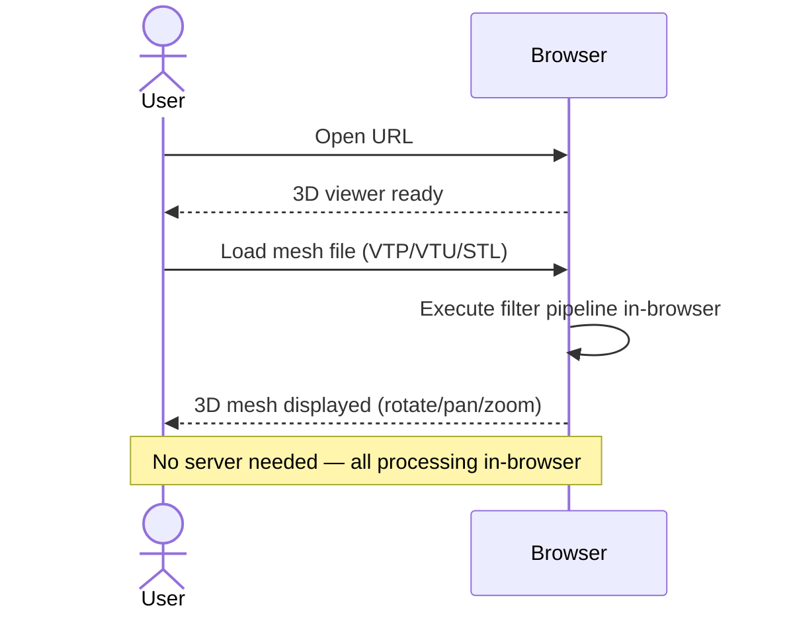
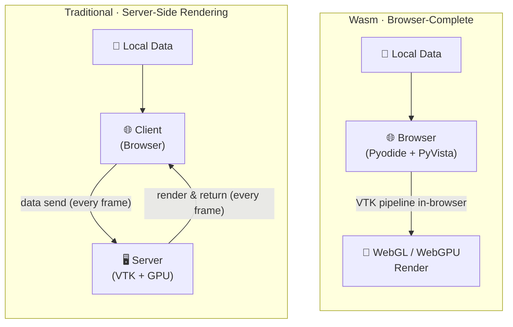
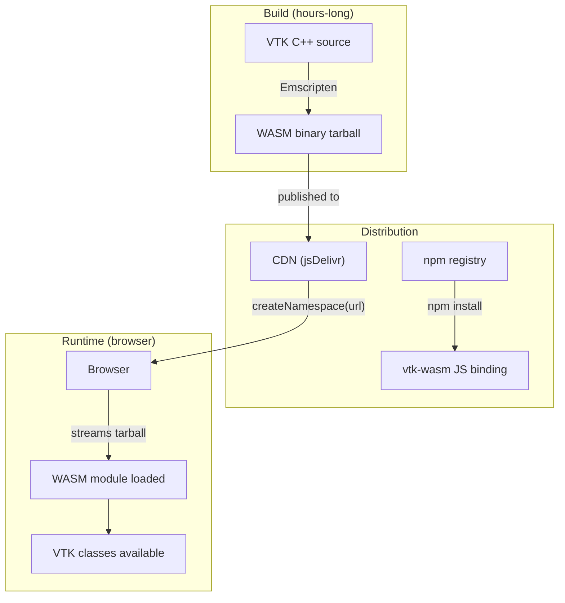
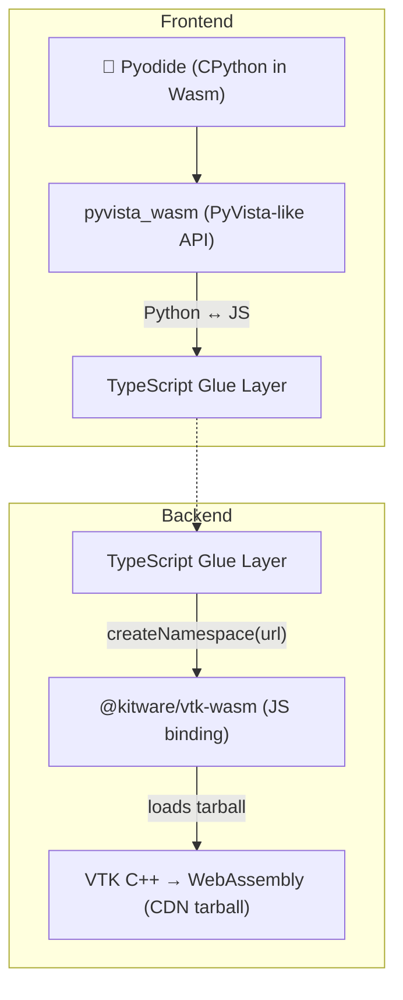

# {{ $t("cover.title") }}

<div class="text-2xl font-light opacity-80">{{ $t("cover.subtitle") }}</div>

<div class="text-sm opacity-70 mt-10 mx-auto max-w-xl">
{{ $t("cover.tagline") }}
</div>

<div class="abs-bl mx-14 my-12 flex items-center gap-3 text-base opacity-80">
  <div>{{ $t("cover.event") }}</div>
  <div class="opacity-40">·</div>
  <div>{{ $t("cover.speaker") }}</div>
</div>

<!-- Single message: this talk is about running PyVista entirely in the browser via WebAssembly — no server required. -->

---
class: text-left
---

# {{ $t("agenda.title") }}

<div class="text-sm opacity-70 mb-6">{{ $t("agenda.subtitle") }}</div>

<div class="flex flex-col gap-4 max-w-2xl">

<div class="flex items-baseline gap-3">
  <div class="text-2xl opacity-40 w-8">1</div>
  <div>
    <div class="font-medium">{{ $t("agenda.i1t") }}</div>
    <div class="text-sm opacity-60">{{ $t("agenda.i1d") }}</div>
  </div>
</div>

<div class="flex items-baseline gap-3">
  <div class="text-2xl opacity-40 w-8">2</div>
  <div>
    <div class="font-medium">{{ $t("agenda.i2t") }}</div>
    <div class="text-sm opacity-60">{{ $t("agenda.i2d") }}</div>
  </div>
</div>

<div class="flex items-baseline gap-3">
  <div class="text-2xl opacity-40 w-8">3</div>
  <div>
    <div class="font-medium">{{ $t("agenda.i3t") }}</div>
    <div class="text-sm opacity-60">{{ $t("agenda.i3d") }}</div>
  </div>
</div>

<div class="flex items-baseline gap-3">
  <div class="text-2xl opacity-40 w-8">4</div>
  <div>
    <div class="font-medium">{{ $t("agenda.i4t") }}</div>
    <div class="text-sm opacity-60">{{ $t("agenda.i4d") }}</div>
  </div>
</div>

</div>

<!-- Single message: here is the four-part agenda for the talk. -->

---
class: text-left
---

# {{ $t("agenda.speaker_title") }}

<div class="text-sm opacity-70 mb-6">{{ $t("agenda.speaker_subtitle") }}</div>

<div class="text-lg font-medium mt-2">{{ $t("agenda.speaker_name") }}</div>

<div class="flex flex-col gap-3 text-sm mt-4 max-w-2xl">

<div class="flex items-baseline gap-3">
  <div class="opacity-50 w-5">🧩</div>
  <div>{{ $t("agenda.speaker_i1") }}</div>
</div>

<div class="flex items-baseline gap-3">
  <div class="opacity-50 w-5">🔧</div>
  <div>{{ $t("agenda.speaker_i2") }}</div>
</div>

<div class="flex items-baseline gap-3">
  <div class="opacity-50 w-5">🐍</div>
  <div>{{ $t("agenda.speaker_i3") }}</div>
</div>

<div class="flex items-baseline gap-3">
  <div class="opacity-50 w-5">🗾</div>
  <div>{{ $t("agenda.speaker_i4") }}</div>
</div>

<div class="flex items-baseline gap-3">
  <div class="opacity-50 w-5">🎤</div>
  <div>{{ $t("agenda.speaker_i5") }}</div>
</div>

</div>

<!-- Single message: who the speaker is and why they are qualified to give this talk. -->

---
layout: two-cols-header
class: text-left
---

<script setup>
const demoUrl = import.meta.env.BASE_URL + 'pyvista-demo.html'
</script>

# {{ $t("pyvista.title") }}

<div class="text-lg opacity-80 mt-1">{{ $t("pyvista.subtitle") }}</div>

::left::

<div class="pr-8 pt-6 flex flex-col gap-5">

<div class="flex items-baseline gap-3">
  <div class="opacity-50 w-5">🏛️</div>
  <div><span class="font-medium">{{ $t("pyvista.i1t") }}</span> — {{ $t("pyvista.i1d") }}</div>
</div>

<div class="flex items-baseline gap-3">
  <div class="opacity-50 w-5">🐍</div>
  <div><span class="font-medium">{{ $t("pyvista.i2t") }}</span> — {{ $t("pyvista.i2d") }}</div>
</div>

<div class="flex items-baseline gap-3">
  <div class="opacity-50 w-5">🩺</div>
  <div><span class="font-medium">{{ $t("pyvista.i3t") }}</span> — {{ $t("pyvista.i3d") }}</div>
</div>

<div class="flex items-baseline gap-3">
  <div class="opacity-50 w-5">🔢</div>
  <div><span class="font-medium">{{ $t("pyvista.i4t") }}</span> — {{ $t("pyvista.i4d") }}</div>
</div>

</div>

::right::

<div class="pt-6 pl-2">

<iframe
  :src="demoUrl"
  class="w-full rounded-lg shadow-xl"
  style="height: 340px; border: 1px solid rgba(125,125,125,0.3)"
></iframe>

<div class="text-xs opacity-60 mt-3 text-center">{{ $t("pyvista.mesh_caption_pre") }} <span class="font-medium">{{ $t("pyvista.mesh_caption_bold") }}</span>.</div>

</div>

<!-- Single message: PyVista is a Pythonic wrapper over VTK's 30-year C++ visualization toolkit — the de facto standard for 3D visualization in Python. The live demo shows a mesh you can rotate. -->

---
class: text-left
---

# {{ $t("problem.title") }}

<div class="text-lg opacity-80 mt-1">{{ $t("problem.subtitle") }}</div>

<div class="pt-6 problem-table">

| {{ $t("problem.col_issue") }} | {{ $t("problem.col_detail") }} |
|---|---|
| {{ $t("problem.i1t") }} | {{ $t("problem.i1d") }} |
| {{ $t("problem.i2t") }} | {{ $t("problem.i2d") }} |
| {{ $t("problem.i3t") }} | {{ $t("problem.i3d") }} |
| {{ $t("problem.i4t") }} | {{ $t("problem.i4d") }} |

</div>

<style>
.problem-table table {
  border-collapse: collapse;
  width: 100%;
}
.problem-table th,
.problem-table td {
  border: 2px solid #555;
  padding: 10px 16px;
}
.problem-table th {
  border-bottom: 3px solid #333;
  background-color: rgba(125,125,125,0.1);
}
</style>

<!-- Single message: sharing 3D results on the web still means running a server — Three.js lacks simulation rendering, SSR needs a server, costs are ongoing, and confidential data must travel to the server. -->

---
class: text-left
---

# {{ $t("why_wasm.title") }}

<div class="text-lg opacity-80 mt-1">{{ $t("why_wasm.subtitle") }}</div>

<div class="flex justify-center mt-4">



</div>

<!-- Single message: WebAssembly runs the whole visualization pipeline in the browser, so every barrier falls away at once — no data sent, no server, no infrastructure. -->

---
class: text-left
---

# {{ $t("arch.title") }}

<div class="text-lg opacity-80 mt-1">{{ $t("arch.subtitle") }}</div>

<div class="flex justify-center mt-6 mermaid-nowrap">



</div>

<style>
.mermaid-nowrap .nodeLabel {
  white-space: nowrap !important;
}
.mermaid-nowrap .edgeLabel {
  white-space: nowrap !important;
}
</style>

<!-- Single message: SSR puts a server in the loop — every frame round-trips over the network. Wasm closes the loop inside the browser — rendering happens where the data already is. -->

---
class: text-left
---

# {{ $t("vtk_wasm.title") }}

<div class="text-lg opacity-80 mt-1">{{ $t("vtk_wasm.subtitle") }}</div>

<div class="pt-6 flex flex-col gap-5 max-w-2xl">

<div class="flex items-baseline gap-3">
  <div class="opacity-50 w-5">🏛️</div>
  <div><span class="font-medium">{{ $t("vtk_wasm.i1t") }}</span> — {{ $t("vtk_wasm.i1d") }}</div>
</div>

<div class="flex items-baseline gap-3">
  <div class="opacity-50 w-5">🩺</div>
  <div><span class="font-medium">{{ $t("vtk_wasm.i2t") }}</span> — {{ $t("vtk_wasm.i2d") }}</div>
</div>

<div class="flex items-baseline gap-3">
  <div class="opacity-50 w-5">📊</div>
  <div><span class="font-medium">{{ $t("vtk_wasm.i3t") }}</span> — {{ $t("vtk_wasm.i3d") }}</div>
</div>

<div class="flex items-baseline gap-3">
  <div class="opacity-50 w-5">🌐</div>
  <div><span class="font-medium">{{ $t("vtk_wasm.i6t") }}</span> — {{ $t("vtk_wasm.i6d") }}</div>
</div>

<div class="flex items-baseline gap-3 mt-2">
  <div class="opacity-50 w-5">➡️</div>
  <div class="opacity-90">{{ $t("vtk_wasm.conc_pre") }} <span class="font-medium">{{ $t("vtk_wasm.conc_bold") }}</span></div>
</div>

</div>

<!-- Single message: vtk.wasm brings VTK's 30 years of capability to the browser — built by Kitware, field-proven, hundreds of filters, now running entirely without a server. Additional detail: OpenGL/Vulkan renderers provide production-grade GPU pipelines (i4). Rich ecosystem includes PyVista, ITK, and NumPy/SciPy (i5). Particularly significant for field demos and client-site presentations (i7). -->

---
class: text-left
---

# {{ $t("history.title") }}

<div class="text-lg opacity-80 mt-1">{{ $t("history.subtitle") }}</div>

<div class="grid grid-cols-3 gap-8 mt-10">

<div class="rounded-lg px-5 py-4" style="border:1px solid rgba(125,125,125,0.3)">
  <div class="text-2xl font-medium">{{ $t("history.y1") }}</div>
  <div class="text-sm opacity-60 mb-3">{{ $t("history.y1l") }}</div>
  <div class="text-sm">{{ $t("history.y1d") }}</div>
</div>

<div class="rounded-lg px-5 py-4" style="border:1px solid rgba(125,125,125,0.3)">
  <div class="text-2xl font-medium">{{ $t("history.y2") }}</div>
  <div class="text-sm opacity-60 mb-3">{{ $t("history.y2l") }}</div>
  <div class="text-sm">{{ $t("history.y2d_pre") }} <span class="font-medium">{{ $t("history.y2d_bold1") }}</span> {{ $t("history.y2d_mid") }} <span class="font-medium">{{ $t("history.y2d_bold2") }}</span> {{ $t("history.y2d_post") }}</div>
</div>

<div class="rounded-lg px-5 py-4" style="border:1px solid rgba(125,125,125,0.3)">
  <div class="text-2xl font-medium">{{ $t("history.y3") }}</div>
  <div class="text-sm opacity-60 mb-3">{{ $t("history.y3l") }}</div>
  <div class="text-sm">{{ $t("history.y3d") }}</div>
</div>

</div>

<div class="flex flex-col gap-4 mt-8">

<div class="flex items-baseline gap-3">
  <div class="opacity-50 w-5">🔄</div>
  <div><span class="font-medium">{{ $t("history.i1t") }}</span> — {{ $t("history.i1d") }}</div>
</div>

<div class="flex items-baseline gap-3">
  <div class="opacity-50 w-5">🛡️</div>
  <div><span class="font-medium">{{ $t("history.i2t") }}</span> — {{ $t("history.i2d") }}</div>
</div>

<div class="flex items-baseline gap-3 mt-2">
  <div class="opacity-50 w-5">➡️</div>
  <div class="opacity-90">{{ $t("history.conc_pre") }} <span class="font-medium">{{ $t("history.conc_bold") }}</span></div>
</div>

</div>

<!-- Single message: from experimental Emscripten builds in 2018 to official npm publication in 2021 to WebGPU support in 2023–2024 — the technology is maturing steadily, with runtime WebGL/WebGPU switching and automatic fallback. -->

---
class: text-left
---

# {{ $t("caps.caps_title") }}

<div class="text-lg opacity-80 mt-1">{{ $t("caps.caps_subtitle") }}</div>

<div class="pt-6 flex flex-col gap-5 max-w-2xl">

<div class="flex items-baseline gap-3">
  <div class="opacity-50 w-5">⚙️</div>
  <div><span class="font-medium">{{ $t("caps.i1t") }}</span> — {{ $t("caps.i1d") }}</div>
</div>

<div class="flex items-baseline gap-3">
  <div class="opacity-50 w-5">📦</div>
  <div><span class="font-medium">{{ $t("caps.i2t") }}</span> — {{ $t("caps.i2d") }}</div>
</div>

<div class="flex items-baseline gap-3">
  <div class="opacity-50 w-5">🎮</div>
  <div><span class="font-medium">{{ $t("caps.i3t") }}</span> — {{ $t("caps.i3d") }}</div>
</div>

<div class="flex items-baseline gap-3">
  <div class="opacity-50 w-5">🐍</div>
  <div><span class="font-medium">{{ $t("caps.i4t") }}</span> — {{ $t("caps.i4d") }}</div>
</div>

</div>

<!-- Single message: vtk.wasm can run the full VTK filter pipeline, load meshes, handle interactive camera, and integrate with Python — all in the browser. -->

---
class: text-left
---

# {{ $t("caps.lim_title") }}

<div class="text-lg opacity-80 mt-1">{{ $t("caps.lim_subtitle") }}</div>

<div class="pt-6 flex flex-col gap-5 max-w-2xl">

<div class="flex items-baseline gap-3">
  <div class="opacity-50 w-5">📏</div>
  <div><span class="font-medium">{{ $t("caps.i5t") }}</span> — {{ $t("caps.i5d") }}</div>
</div>

<div class="flex items-baseline gap-3">
  <div class="opacity-50 w-5">🧵</div>
  <div><span class="font-medium">{{ $t("caps.i6t") }}</span> — {{ $t("caps.i6d") }}</div>
</div>

<div class="flex items-baseline gap-3">
  <div class="opacity-50 w-5">🚩</div>
  <div><span class="font-medium">{{ $t("caps.i7t") }}</span> — {{ $t("caps.i7d") }}</div>
</div>

<div class="flex items-baseline gap-3">
  <div class="opacity-50 w-5">⏳</div>
  <div><span class="font-medium">{{ $t("caps.i8t") }}</span> — {{ $t("caps.i8d") }}</div>
</div>

<div class="flex items-baseline gap-3 mt-2">
  <div class="opacity-50 w-5">➡️</div>
  <div class="opacity-90">{{ $t("caps.conc_pre") }} <span class="font-medium">{{ $t("caps.conc_bold") }}</span></div>
</div>

</div>

<!-- Single message: there are real limitations — module size, COOP/COEP, WebGPU flags, initial load — but ~100K elements run at practical interactive speed. -->

---
class: text-left
---

# {{ $t("build_dist.build_title") }}

<div class="text-lg opacity-80 mt-1">{{ $t("build_dist.build_subtitle") }}</div>

<div class="pt-6 flex flex-col gap-5 max-w-2xl">

<div class="flex items-baseline gap-3">
  <div class="opacity-50 w-5">🏗️</div>
  <div><span class="font-medium">{{ $t("build_dist.i1t") }}</span> — {{ $t("build_dist.i1d") }} <code>npm install</code></div>
</div>

<div class="flex items-baseline gap-3">
  <div class="opacity-50 w-5">📦</div>
  <div><span class="font-medium">{{ $t("build_dist.i2t") }}</span> — {{ $t("build_dist.i2d") }}</div>
</div>

</div>

<!-- Single message: VTK's C++ is compiled to WebAssembly via Emscripten (a hours-long build), and consumers just npm install the @kitware/vtk-wasm binding package. -->

---
class: text-left
---

# {{ $t("build_dist.dist_title") }}

<div class="text-lg opacity-80 mt-1">{{ $t("build_dist.dist_subtitle") }}</div>

<div class="flex justify-center mt-6">



</div>

<!-- Single message: the WASM binary streams from CDN at runtime via createNamespace(url); jsDelivr's multi-CDN edge cache is faster than GitLab in Asia. -->

---
layout: two-cols-header
class: text-left
---

# {{ $t("pipeline.title") }}

<div class="text-lg opacity-80 mt-1">{{ $t("pipeline.subtitle") }}</div>

::left::

<div class="pr-6 pt-6 flex flex-col gap-5">

<div class="flex items-baseline gap-3">
  <div class="opacity-50 w-5">🏗️</div>
  <div><span class="font-medium">{{ $t("pipeline.i1t") }}</span> — {{ $t("pipeline.i1d") }}</div>
</div>

<div class="flex items-baseline gap-3">
  <div class="opacity-50 w-5">⏳</div>
  <div><span class="font-medium">{{ $t("pipeline.i2t") }}</span> — {{ $t("pipeline.i2d") }} <code>npm install @kitware/vtk-wasm</code></div>
</div>

<div class="flex items-baseline gap-3">
  <div class="opacity-50 w-5">📦</div>
  <div><span class="font-medium">{{ $t("pipeline.i3t") }}</span> — {{ $t("pipeline.i3d") }}</div>
</div>

<div class="flex items-baseline gap-3 mt-2">
  <div class="opacity-50 w-5">➡️</div>
  <div class="opacity-90">{{ $t("pipeline.conc_pre") }} <span class="font-medium">{{ $t("pipeline.conc_bold") }}</span></div>
</div>

</div>

::right::

<div class="pl-6 pt-6">

<div class="text-sm font-medium opacity-60 mb-3">{{ $t("pipeline.config_label") }}</div>

```js
export default {
  build: {
    target: 'esnext',
  },
  optimizeDeps: {
    exclude: ['@kitware/vtk-wasm'],
  },
};
```

<div class="flex flex-col gap-4 mt-6">

<div class="flex items-baseline gap-3">
  <div class="opacity-50 w-5">🎯</div>
  <div><span class="font-medium">{{ $t("pipeline.i4t") }}</span> — {{ $t("pipeline.i4d") }}</div>
</div>

<div class="flex items-baseline gap-3">
  <div class="opacity-50 w-5">🚫</div>
  <div><span class="font-medium">{{ $t("pipeline.i5t") }}</span> — {{ $t("pipeline.i5d") }}</div>
</div>

</div>

</div>

<!-- Single message: one Vite config unlocks the entire VTK Emscripten build pipeline — C++ compiled to Wasm once, consumers just npm install, and two Vite lines (build.target esnext + optimizeDeps.exclude) are all that stands between you and browser-native VTK. -->

---
class: text-left
---

# {{ $t("pyodide.title") }}

<div class="text-lg opacity-80 mt-1">{{ $t("pyodide.subtitle") }}</div>

<div class="mt-4">



</div>

<!-- Single message: Pyodide (CPython in Wasm) meets PyVista (Pythonic VTK wrapper) — write Python in the browser, render 3D meshes, no server required. TypeScript is the glue layer; runtime fallback uses XMLHttpRequest when "pyodide" in sys.modules. -->

---
layout: two-cols-header
class: text-left
---

# {{ $t("rendering.title") }}

<div class="text-lg opacity-80 mt-1">{{ $t("rendering.subtitle") }}</div>

::left::

<div class="pr-6 pt-6 flex flex-col gap-5">

<div class="text-sm font-medium opacity-60 mb-1">{{ $t("rendering.webgl_label") }}</div>

<div class="flex items-baseline gap-3">
  <div class="opacity-50 w-5">🌐</div>
  <div><span class="font-medium">{{ $t("rendering.i1t") }}</span> — {{ $t("rendering.i1d") }}</div>
</div>

<div class="flex items-baseline gap-3">
  <div class="opacity-50 w-5">🎨</div>
  <div><span class="font-medium">{{ $t("rendering.i2t") }}</span> — {{ $t("rendering.i2d") }}</div>
</div>

<div class="flex items-baseline gap-3">
  <div class="opacity-50 w-5">🛡️</div>
  <div><span class="font-medium">{{ $t("rendering.i3t") }}</span> — {{ $t("rendering.i3d") }}</div>
</div>

</div>

::right::

<div class="pl-6 pt-6 flex flex-col gap-5">

<div class="text-sm font-medium opacity-60 mb-1">{{ $t("rendering.webgpu_label") }}</div>

<div class="flex items-baseline gap-3">
  <div class="opacity-50 w-5">⚡</div>
  <div><span class="font-medium">{{ $t("rendering.i4t") }}</span> — {{ $t("rendering.i4d") }}</div>
</div>

<div class="flex items-baseline gap-3">
  <div class="opacity-50 w-5">🧮</div>
  <div><span class="font-medium">{{ $t("rendering.i5t") }}</span> — {{ $t("rendering.i5d") }}</div>
</div>

<div class="flex items-baseline gap-3">
  <div class="opacity-50 w-5">🚩</div>
  <div><span class="font-medium">{{ $t("rendering.i6t") }}</span> — {{ $t("rendering.i6d") }}</div>
</div>

<div class="flex items-baseline gap-3 mt-2">
  <div class="opacity-50 w-5">🔄</div>
  <div><span class="font-medium">{{ $t("rendering.i7t") }}</span> — {{ $t("rendering.i7d") }}</div>
</div>

</div>

<!-- Single message: two render backends, one runtime — WebGL is the universally supported baseline, WebGPU pushes performance further with GPU compute, and the runtime switches between them with automatic fallback. -->

---
layout: two-cols-header
class: text-left
---

# {{ $t("dev_ci.title") }}

<div class="text-lg opacity-80 mt-1">{{ $t("dev_ci.subtitle") }}</div>

::left::

<div class="pr-6 pt-6 flex flex-col gap-5">

<div class="flex items-baseline gap-3">
  <div class="opacity-50 w-5">⏳</div>
  <div><span class="font-medium">{{ $t("dev_ci.i1t") }}</span> — <code>createNamespace()</code> {{ $t("dev_ci.i1d1") }} <code>async/await</code>{{ $t("dev_ci.i1d2") }} <code>await</code> {{ $t("dev_ci.i1d3") }}</div>
</div>

<div class="flex items-baseline gap-3">
  <div class="opacity-50 w-5">🧵</div>
  <div><span class="font-medium">{{ $t("dev_ci.i2t") }}</span> — {{ $t("dev_ci.i2d1") }} <code>Cross-Origin-Opener-Policy: same-origin</code> {{ $t("dev_ci.i2d2") }} <code>Cross-Origin-Embedder-Policy: require-corp</code></div>
</div>

<div class="flex items-baseline gap-3 mt-2">
  <div class="opacity-50 w-5">➡️</div>
  <div class="opacity-90">{{ $t("dev_ci.conc_pre") }} <span class="font-medium">{{ $t("dev_ci.conc_bold") }}</span></div>
</div>

</div>

::right::

<div class="pl-6 pt-6">

<div class="text-sm font-medium opacity-60 mb-3">{{ $t("dev_ci.config_label") }}</div>

```js
import crossOriginIsolation
  from 'vite-plugin-cross-origin-isolation';

export default {
  plugins: [crossOriginIsolation()],
  build: { target: 'esnext' },
  optimizeDeps: { exclude: ['@kitware/vtk-wasm'] },
};
```

<div class="flex flex-col gap-4 mt-6">

</div>

</div>

<!-- Single message: three pitfalls every vtk.wasm integration hits — async/await for all VTK operations, SharedArrayBuffer requiring COOP/COEP headers — and the fixes: vite-plugin-cross-origin-isolation injects the headers (i3), CDN must send CORS headers for the tarball URL (i4), jsDelivr's multi-CDN edge cache is CORS-enabled and faster in Asia than GitLab (i5). -->

---
layout: two-cols-header
class: text-left
---

# {{ $t("sphere.title") }}

<div class="text-lg opacity-80 mt-1">{{ $t("sphere.subtitle") }}</div>

::left::

<div class="pr-6 pt-6 flex flex-col gap-5">

<div class="text-sm font-medium opacity-60 mb-1">{{ $t("sphere.pipeline_label") }}</div>

<div class="flex items-baseline gap-3">
  <div class="opacity-50 w-5">1</div>
  <div><span class="font-medium">{{ $t("sphere.i1t") }}</span> — {{ $t("sphere.i1d") }} <code>vtkPolyData</code></div>
</div>

<div class="flex items-baseline gap-3">
  <div class="opacity-50 w-5">2</div>
  <div><span class="font-medium">{{ $t("sphere.i2t") }}</span> — {{ $t("sphere.i2d") }}</div>
</div>

<div class="flex items-baseline gap-3">
  <div class="opacity-50 w-5">3</div>
  <div><span class="font-medium">{{ $t("sphere.i3t") }}</span> — {{ $t("sphere.i3d") }}</div>
</div>

<div class="flex items-baseline gap-3">
  <div class="opacity-50 w-5">4</div>
  <div><span class="font-medium">{{ $t("sphere.i4t") }}</span> — {{ $t("sphere.i4d") }}</div>
</div>

<div class="flex items-baseline gap-3 mt-2">
  <div class="opacity-50 w-5">✏️</div>
  <div><span class="font-medium">{{ $t("sphere.i5t") }}</span> — {{ $t("sphere.i5d") }}</div>
</div>

</div>

::right::

<div class="pl-6 pt-6">

<div class="text-sm font-medium opacity-60 mb-3">{{ $t("sphere.code_label") }}</div>

```js
createNamespace(WASM_URL).then(async (vtk) => {
  const sphere = vtk.vtkSphereSource.newInstance();
  sphere.setRadius(0.5);
  sphere.setThetaResolution(16);

  const mapper = vtk.vtkPolyDataMapper.newInstance();
  mapper.setInputConnection(sphere.getOutputPort());

  const actor = vtk.vtkActor.newInstance();
  actor.setMapper(mapper);

  const renderer = vtk.vtkRenderer.newInstance();
  renderer.addActor(actor);
  renderer.resetCamera();
});
```

<div class="flex flex-col gap-4 mt-6">

</div>

</div>

<!-- Single message: four VTK objects form the minimal complete pipeline — vtkSphereSource → vtkPolyDataMapper → vtkActor → vtkRenderer. Additional detail: StackBlitz lets you edit parameters in the browser (i5). createNamespace() returns a Promise; all VTK operations must be awaited (i6). SharedArrayBuffer requires COOP/COEP headers (i7). The tarball URL must allow CORS; prefer jsDelivr (i8). -->

---
class: text-left
---

<script setup>
const jlDemoUrl = 'https://pyvista-wasm.readthedocs.io/en/latest/lite/lab/index.html?path=intro.ipynb'
</script>

# {{ $t("demo_jl.title") }}

<div class="mt-2">
  <a :href="jlDemoUrl" class="text-sm break-all opacity-80 hover:opacity-100" target="_blank">pyvista-wasm.readthedocs.io/en/latest/lite/lab/</a>
</div>

<div class="pt-2">
  <iframe
    :src="jlDemoUrl"
    class="w-full rounded-lg shadow-xl"
    style="height: 400px; border: 1px solid rgba(125,125,125,0.3)"
    loading="lazy"
  ></iframe>
</div>

<!-- Single message: JupyterLite is a browser-only Jupyter environment — write Python, render 3D meshes, share by URL. -->

---
class: text-left
---

<script setup>
const marimoDemoUrl = 'https://marimo.app/?code=JYWwDg9gTgLgBCAhlUEBQaD6mDmBTAOzykRjwBNMB3YGACzgF44AiABgDoBGAZg4DYWaRGDBMEyVBwCCogBQ1y9RixAVgAVxAsAlBjQABEWA4BjPABsLwgM4BPAqbjk8AMziY5OgFxo4-uFBIWARgUygIMGAwDAC4RCpEWlDwyOiOYAIbGEQrORYwOwA3YGzEAFpEm209OKg8GA0oAjg5EDCIqLAAGj0MI1EzS2sXd0921K6fPwCg6HhCkrLqRGr4mzgwIpn-VwiQTeLSnJW1uZC8AA9EcAs8G1iA+sbmuCubsDubbs3t-uMhlY0KMPHJ3rd7j8ttM4p8IDAyFBxFsOAAFCzwxFeHYIe4MZjgz73DjkCBUAgYxCUABGGgIBDs2NhGIRxA4VMoahsdDaeNqAThrKgHG5ZOxGGAY0wBBueGwTGYLGwSEy2BYvjiAKgdOxQA'
</script>

# {{ $t("demo_marimo.title") }}

<div class="mt-2">
  <a :href="marimoDemoUrl" class="text-sm break-all opacity-80 hover:opacity-100" target="_blank">marimo.app — pyvista-wasm reactive demo</a>
</div>

<div class="pt-2">
  <iframe
    :src="marimoDemoUrl"
    class="w-full rounded-lg shadow-xl"
    style="height: 400px; border: 1px solid rgba(125,125,125,0.3)"
    loading="lazy"
  ></iframe>
</div>

<!-- Single message: marimo is a reactive Python notebook — change a slider, the mesh redraws instantly, no rerun button needed. -->

---
class: text-left
---

<script setup>
const stliteDemoUrl = 'https://edit.share.stlite.net/#!CgZhcHAucHkSxQQKBmFwcC5weRK6BAq3BCIiIlN0cmVhbWxpdCBhcHAgZm9yIHRoZSBweXZpc3RhLWpzIHN0bGl0ZSBkZW1vLiIiIgoKaW1wb3J0IHN0cmVhbWxpdCBhcyBzdAppbXBvcnQgc3RyZWFtbGl0LmNvbXBvbmVudHMudjEgYXMgY29tcG9uZW50cwoKaW1wb3J0IHB5dmlzdGFfd2FzbSBhcyBwdgpmcm9tIHB5dmlzdGFfd2FzbSBpbXBvcnQgZXhhbXBsZXMKCmNvbG9yID0gc3Quc2VsZWN0Ym94KAogICAgIkNvbG9yIiwKICAgIFsiZ3JheSIsICJ3aGl0ZSIsICJyZWQiLCAiZ3JlZW4iLCAiYmx1ZSIsICJ5ZWxsb3ciLCAiY3lhbiIsICJtYWdlbnRhIl0sCikKCm9wYWNpdHkgPSBzdC5zbGlkZXIoIk9wYWNpdHkiLCBtaW5fdmFsdWU9MC4wLCBtYXhfdmFsdWU9MS4wLCB2YWx1ZT0wLjgsIHN0ZXA9MC4xKQoKcGxvdHRlciA9IHB2LlBsb3R0ZXIoKQoKbWVzaCA9IGV4YW1wbGVzLmRvd25sb2FkX2J1bm55KCkKCnBsb3R0ZXIuYWRkX21lc2gobWVzaCwgY29sb3I9Y29sb3IsIG9wYWNpdHk9b3BhY2l0eSkKCmh0bWwgPSBwbG90dGVyLmdlbmVyYXRlX3N0YW5kYWxvbmVfaHRtbCgpCmNvbXBvbmVudHMuaHRtbChodG1sLCBoZWlnaHQ9NjAwKRoMcHl2aXN0YS13YXNt'
</script>

# {{ $t("demo_stlite.title") }}

<div class="mt-2">
  <a :href="stliteDemoUrl" class="text-sm break-all opacity-80 hover:opacity-100" target="_blank">share.stlite.net — pyvista-wasm stlite demo</a>
</div>

<div class="pt-2">
  <iframe
    :src="stliteDemoUrl"
    class="w-full rounded-lg shadow-xl"
    style="height: 400px; border: 1px solid rgba(125,125,125,0.3)"
    loading="lazy"
  ></iframe>
</div>

<!-- Single message: stlite runs Streamlit entirely in the browser — the Stanford Bunny demo with color and opacity widgets shows a server-less interactive app. -->

---
layout: two-cols-header
class: text-left
---

# {{ $t("roadmap.title") }}

<div class="text-lg opacity-80 mt-1">{{ $t("roadmap.subtitle") }}</div>

::left::

<div class="pr-6 pt-6 flex flex-col gap-5">

<div class="text-sm font-medium opacity-60 mb-1">{{ $t("roadmap.milestones_label") }}</div>

<div class="flex items-baseline gap-3">
  <div class="opacity-50 w-5">⚡</div>
  <div><span class="font-medium">{{ $t("roadmap.i1t") }}</span> — {{ $t("roadmap.i1d") }}</div>
</div>

<div class="flex items-baseline gap-3">
  <div class="opacity-50 w-5">🐍</div>
  <div><span class="font-medium">{{ $t("roadmap.i2t") }}</span> — {{ $t("roadmap.i2d") }}</div>
</div>

<div class="flex items-baseline gap-3">
  <div class="opacity-50 w-5">🔄</div>
  <div><span class="font-medium">{{ $t("roadmap.i3t") }}</span> — {{ $t("roadmap.i3d") }}</div>
</div>

</div>

::right::

<div class="pl-6 pt-6 flex flex-col gap-5">

<div class="text-sm font-medium opacity-60 mb-1">{{ $t("roadmap.matters_label") }}</div>

<div class="flex items-baseline gap-3">
  <div class="opacity-50 w-5">🏛️</div>
  <div><span class="font-medium">{{ $t("roadmap.i4t") }}</span> — {{ $t("roadmap.i4d") }}</div>
</div>

<div class="flex items-baseline gap-3">
  <div class="opacity-50 w-5">🌐</div>
  <div><span class="font-medium">{{ $t("roadmap.i5t") }}</span> — {{ $t("roadmap.i5d") }}</div>
</div>

<div class="flex items-baseline gap-3">
  <div class="opacity-50 w-5">📈</div>
  <div><span class="font-medium">{{ $t("roadmap.i6t") }}</span> — {{ $t("roadmap.i6d") }}</div>
</div>

<div class="flex items-baseline gap-3 mt-2">
  <div class="opacity-50 w-5">➡️</div>
  <div class="opacity-90">{{ $t("roadmap.conc_pre") }} <span class="font-medium">{{ $t("roadmap.conc_bold") }}</span></div>
</div>

</div>

<!-- Single message: the technology is maturing steadily — key milestones are WebGPU stabilization, Pyodide + PyVista maturity, and runtime backend switching. Why it matters: 30 years of VTK in the browser, expanding accessibility, broader applications ahead. The next chapter is browser-native GPU compute. -->

---
class: text-left
---

# {{ $t("inspiration.subtitle") }}

<div class="text-lg opacity-80 mt-1">{{ $t("inspiration.title") }}</div>

<div class="pt-6 flex flex-col gap-3">

<a href="https://tech.akariinc.co.jp/entry/2026/05/03/115708" class="block rounded-lg overflow-hidden border-0! no-underline!">
  
</a>

</div>

<!-- Single message: this talk is inspired by the Akari Inc. tech blog article on browser-complete 3D visualization with vtk.wasm — read it for the longer write-up. -->

---
class: text-left
---

# {{ $t("cta.cta_title") }}

<div class="text-lg opacity-80 mt-1">{{ $t("cta.subtitle") }}</div>

<div class="pt-6 flex flex-col gap-5 max-w-2xl">

<div class="text-sm font-medium opacity-60 mb-1">{{ $t("cta.areas_label") }}</div>

<div class="flex items-baseline gap-3">
  <div class="opacity-50 w-5">⚙️</div>
  <div><span class="font-medium">{{ $t("cta.i1t") }}</span> — {{ $t("cta.i1d") }}</div>
</div>

<div class="flex items-baseline gap-3">
  <div class="opacity-50 w-5">📦</div>
  <div><span class="font-medium">{{ $t("cta.i2t") }}</span> — {{ $t("cta.i2d") }}</div>
</div>

<div class="flex items-baseline gap-3">
  <div class="opacity-50 w-5">⚡</div>
  <div><span class="font-medium">{{ $t("cta.i3t") }}</span> — {{ $t("cta.i3d") }}</div>
</div>

<div class="flex items-baseline gap-3">
  <div class="opacity-50 w-5">📖</div>
  <div><span class="font-medium">{{ $t("cta.i4t") }}</span> — {{ $t("cta.i4d") }}</div>
</div>

<div class="flex items-baseline gap-3 mt-2">
  <div class="opacity-50 w-5">💬</div>
  <div class="opacity-90">{{ $t("cta.welcome") }}</div>
</div>

<div class="rounded-lg px-5 py-4 mt-2" style="border:1px solid rgba(125,125,125,0.3)">
  <div class="text-sm font-medium opacity-60 mb-1">{{ $t("cta.repo_label") }}</div>
  <a href="https://github.com/tkoyama010/pyvista-wasm" class="text-sm break-all opacity-80 hover:opacity-100">github.com/tkoyama010/pyvista-wasm</a>
</div>

</div>

<!-- Single message: pyvista-wasm welcomes contributions — new VTK filters, file formats, performance improvements, docs & translations. Small fixes are very welcome. -->

---
class: text-left
---

# {{ $t("cta.qa_title") }}

<div class="text-lg opacity-80 mt-1">{{ $t("cta.qa_subtitle") }}</div>

<div class="pt-6 flex flex-col gap-5 max-w-2xl">

<div class="text-sm font-medium opacity-60 mb-1">{{ $t("cta.topics_label") }}</div>

<div class="flex items-baseline gap-3">
  <div class="opacity-50 w-5">🏗️</div>
  <div><span class="font-medium">{{ $t("cta.i5t") }}</span> — {{ $t("cta.i5d") }}</div>
</div>

<div class="flex items-baseline gap-3">
  <div class="opacity-50 w-5">🌐</div>
  <div><span class="font-medium">{{ $t("cta.i6t") }}</span> — {{ $t("cta.i6d") }}</div>
</div>

<div class="flex items-baseline gap-3">
  <div class="opacity-50 w-5">❓</div>
  <div><span class="font-medium">{{ $t("cta.i7t") }}</span> — {{ $t("cta.i7d") }}</div>
</div>

<div class="flex items-baseline gap-3 mt-6">
  <div class="opacity-50 w-5">🎤</div>
  <div class="text-2xl font-medium">{{ $t("cta.qa") }}</div>
</div>

<div class="text-sm opacity-70">{{ $t("cta.thank_you") }}</div>

</div>

<!-- Single message: Q&A — discussion topics include porting to WASM, browser-based science, and whether WASM is necessary. Thank you. -->
