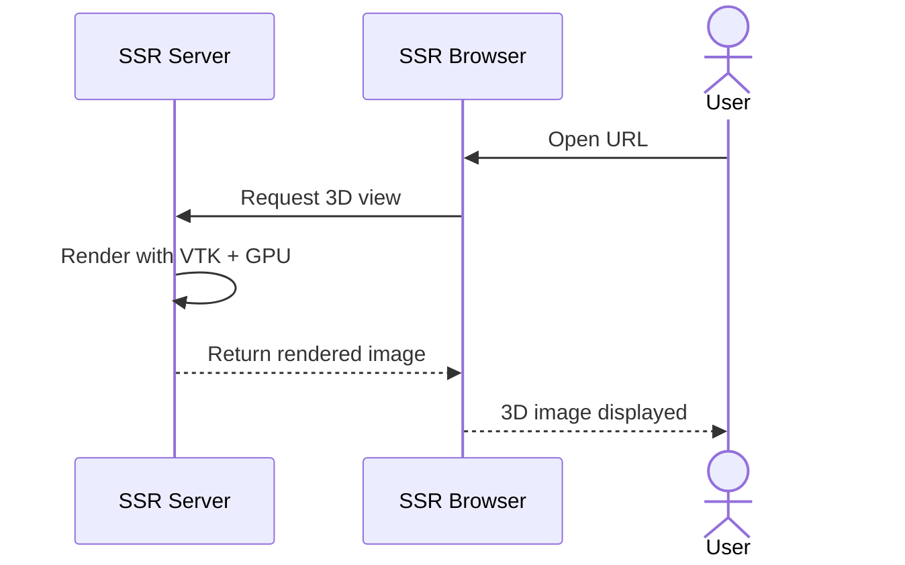
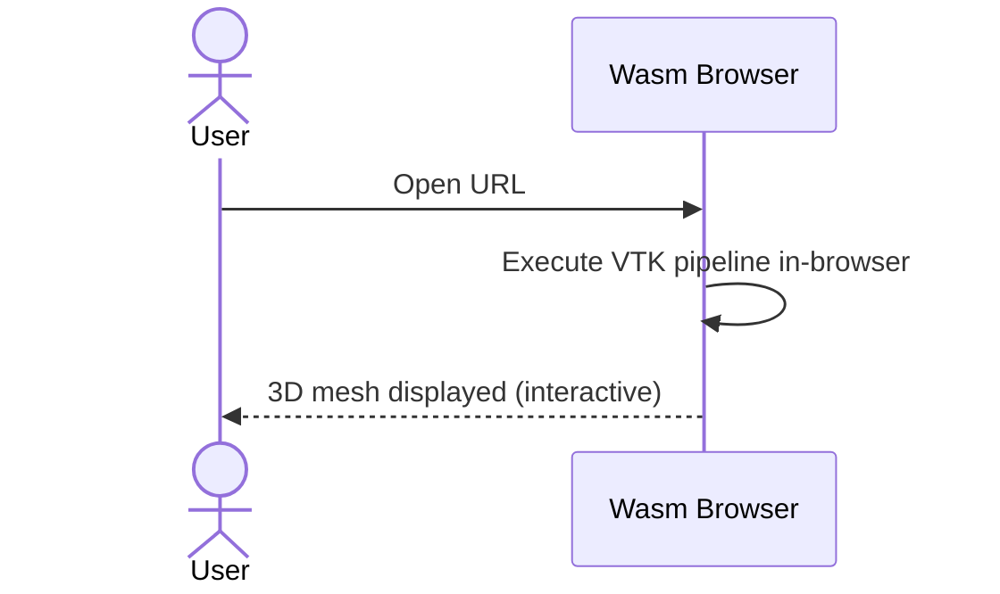
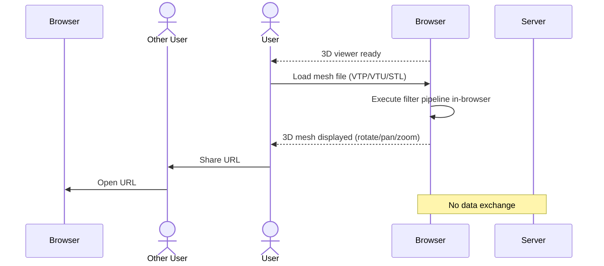
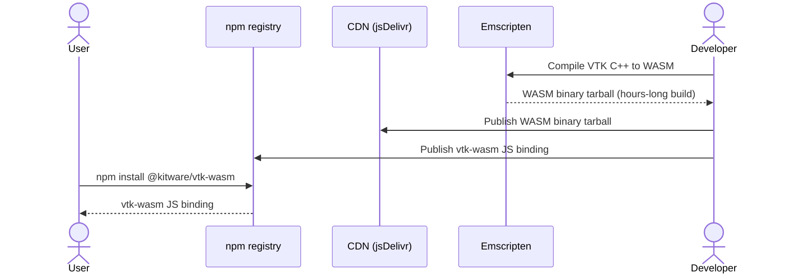
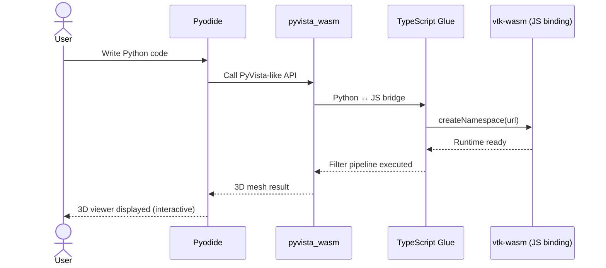

# {{ $t("cover.title") }}

<div class="text-2xl font-light opacity-80">{{ $t("cover.subtitle") }}</div>

<div class="text-sm opacity-70 mt-10 mx-auto max-w-xl">
{{ $t("cover.tagline") }}
</div>

<div class="abs-bl mx-14 my-12 flex items-center gap-3 text-base opacity-80">
  <div>{{ $t("cover.event") }}</div>
  <div class="opacity-40">·</div>
  <div>{{ $t("cover.speaker") }}</div>
</div>

<!-- Single message: this talk is about running PyVista entirely in the browser via WebAssembly — no server required. -->
<!-- $t("script.s1") -->

---
class: text-left
---

<script setup>
// Assets under public/ must be prefixed with Vite's base — the deck is built
// with --base /pyvista-wasm/slides/, so a root-absolute src would 404.
const base = import.meta.env.BASE_URL
</script>

# {{ $t("agenda.title") }}

<div class="text-sm opacity-70 mb-3">{{ $t("agenda.subtitle") }}</div>

<div class="grid grid-cols-3 gap-5 pt-1 agenda-cards">

<Link :to="4">
<div class="flex flex-col gap-2">

<div class="flex items-baseline gap-2">
<div class="text-xl opacity-40">1</div>
<div>
<div class="font-medium text-sm">{{ $t("agenda.i1t") }}</div>
<div class="text-xs opacity-60">{{ $t("agenda.i1d") }}</div>
</div>
</div>
</div>
</Link>

<Link :to="11">
<div class="flex flex-col gap-2">

<div class="flex items-baseline gap-2">
<div class="text-xl opacity-40">2</div>
<div>
<div class="font-medium text-sm">{{ $t("agenda.i2t") }}</div>
<div class="text-xs opacity-60">{{ $t("agenda.i2d") }}</div>
</div>
</div>
</div>
</Link>

<Link :to="17">
<div class="flex flex-col gap-2">

<div class="flex items-baseline gap-2">
<div class="text-xl opacity-40">3</div>
<div>
<div class="font-medium text-sm">{{ $t("agenda.i3t") }}</div>
<div class="text-xs opacity-60">{{ $t("agenda.i3d") }}</div>
</div>
</div>
</div>
</Link>

</div>

<!-- Single message: the talk runs in three parts — click any thumbnail to jump straight to that section. -->
<!-- $t("script.s2") -->


---
layout: two-cols-header
class: text-left
---

# {{ $t("agenda.speaker_title") }}

<div class="text-sm opacity-70">{{ $t("agenda.speaker_subtitle") }}</div>

::left::

<div class="pr-4 pt-2">

```py
class TetsuoKoyama:
    def __init__(self):
        self.name = "Tetsuo Koyama"
        self.role = "AI Engineer"
        self.location = "Japan 🇯🇵"
        self.interests = [
            "Scientific Computing",
            "3D Visualization",
            "Finite Element Method",
            "Open Source Development",
        ]
        self.languages = ["Japanese", "English"]

    def get_current_projects(self):
        return {
            "PyVista": "3D plotting and mesh analysis",
            "GetFEM": "Finite Element Method library",
            "pyOpenSci": "Scientific Python packaging",
        }

    def say_hi(self):
        print("Thanks for visiting my profile! 🎉")
        print("Feel free to explore my projects and connect!")


me = TetsuoKoyama()
me.say_hi()
```

</div>

::right::

<div class="pl-4 pt-2 flex flex-col items-center gap-4">
  
  <div class="text-sm opacity-80 text-center leading-relaxed">
    AI engineer @AKARI-Inc 3D visualization library @pyvista maintainer,
    @scipy-conference chairperson, Technical Steering Committee of @numfocus
    photo @pyconjp
  </div>
  
  <a href="https://github.com/tkoyama010" class="text-xs opacity-70 hover:opacity-100">github.com/tkoyama010</a>
</div>

<style>
/* The profile snippet is ~28 lines, so it needs smaller code type to sit
   beside the photo without overflowing the slide. */
.slidev-code {
  font-size: 0.55rem !important;
  line-height: 1.3 !important;
}
</style>

<!-- Single message: who the speaker is and why they are qualified to give this talk. -->
<!-- $t("script.s3") -->

---
class: text-left
layout: full
---

# {{ $t("pyvista.title") }}

<div class="text-sm opacity-80 mb-2">{{ $t("pyvista.subtitle") }}</div>

<iframe src="https://pyvista.org/" class="w-full rounded-lg" style="height: 500px; border: 0;" allowfullscreen></iframe>

<!-- Single message: PyVista is a Pythonic wrapper over VTK's 30-year C++ visualization toolkit — the de facto standard for 3D visualization in Python. -->
<!-- $t("script.s4") -->

---
class: text-left
layout: full
---

# {{ $t("vtk_wasm.title") }}

<div class="text-sm opacity-80 mb-2">{{ $t("vtk_wasm.subtitle") }}</div>

<iframe src="https://tkoyama010.github.io/awesome-vtk/" class="w-full rounded-lg" style="height: 500px; border: 0;" allowfullscreen></iframe>

<!-- Single message: a curated list of VTK projects — how widely VTK is actually used. -->
<!-- $t("script.s5") -->

---
class: text-left
---

# {{ $t("problem.title") }}

<div class="text-lg opacity-80 mt-1">{{ $t("problem.subtitle") }}</div>

<div class="pt-6 problem-table">

| {{ $t("problem.col_issue") }} | {{ $t("problem.col_detail") }} |
|---|---|
| {{ $t("problem.i1t") }} | {{ $t("problem.i1d") }} |
| {{ $t("problem.i2t") }} | {{ $t("problem.i2d") }} |
| {{ $t("problem.i3t") }} | {{ $t("problem.i3d") }} |
| {{ $t("problem.i4t") }} | {{ $t("problem.i4d") }} |

</div>

<!-- Single message: sharing 3D results on the web still means running a server — Three.js lacks simulation rendering, SSR needs a server, costs are ongoing, and confidential data must travel to the server. -->
<!-- $t("script.s6") -->

---
class: text-left
---

# {{ $t("arch.title") }}

<div class="text-lg opacity-80 mt-1">{{ $t("arch.subtitle") }}</div>

<div class="flex justify-center mt-6 gap-8">





</div>

<style>
.mermaid-nowrap .nodeLabel {
  white-space: nowrap !important;
}
.mermaid-nowrap .edgeLabel {
  white-space: nowrap !important;
}
</style>

<!-- Single message: SSR puts a server in the loop — every frame round-trips over the network. Wasm closes the loop inside the browser — rendering happens where the data already is. -->
<!-- $t("script.s7") -->

---
class: text-left
---

# {{ $t("why_wasm.title") }}

<div class="text-lg opacity-80 mt-1">{{ $t("why_wasm.subtitle") }}</div>

<div class="flex justify-center mt-4">



</div>

<!-- Single message: WebAssembly runs the whole visualization pipeline in the browser, so every barrier falls away at once — no data sent, no server, no infrastructure. -->
<!-- $t("script.s8") -->

---
class: text-left
layout: full
---

# {{ $t("history.title") }}

<div class="text-sm opacity-80">{{ $t("history.subtitle") }}</div>

<iframe src="https://kitware.github.io/vtk-wasm/demo/plain-javascript.html" class="w-full mt-1 rounded-lg" style="height: 380px" frameborder="0"></iframe>

<!-- Single message: a live demo of vtk-wasm running entirely in the browser — no server, no install, just open the page. -->
<!-- $t("script.s9") -->

---
class: text-left
layout: full
---

# {{ $t("demos.title") }}

<div class="text-sm opacity-80 mb-2">{{ $t("demos.subtitle") }}</div>

<div class="grid grid-cols-3 gap-3">
  <div>
    <iframe src="https://kitware.github.io/vtk-wasm/demo/viewer-porsche.html" class="w-full rounded-lg" style="height: 150px; border: 1px solid rgba(125,125,125,0.3)"></iframe>
    <div class="text-xs mt-1 font-medium">Porsche</div>
    <div class="text-xs opacity-60">Multi-actor CAD assembly, picking</div>
  </div>
  <div>
    <iframe src="https://kitware.github.io/vtk-wasm/demo/terrain.html" class="w-full rounded-lg" style="height: 150px; border: 1px solid rgba(125,125,125,0.3)"></iframe>
    <div class="text-xs mt-1 font-medium">Procedural terrain</div>
    <div class="text-xs opacity-60">351k triangles built in the browser</div>
  </div>
  <div>
    <iframe src="https://kitware.github.io/vtk-wasm/demo/viewer-starfighter2.html" class="w-full rounded-lg" style="height: 150px; border: 1px solid rgba(125,125,125,0.3)"></iframe>
    <div class="text-xs mt-1 font-medium">Starfighter</div>
    <div class="text-xs opacity-60">Glyphs, scalar bar, interactive widgets</div>
  </div>
  <div>
    <iframe src="https://kitware.github.io/vtk-wasm/demo/volume.html" class="w-full rounded-lg" style="height: 150px; border: 1px solid rgba(125,125,125,0.3)"></iframe>
    <div class="text-xs mt-1 font-medium">Volume rendering</div>
    <div class="text-xs opacity-60">531k voxels ray cast on the GPU</div>
  </div>
  <div>
    <iframe src="https://kitware.github.io/vtk-wasm/demo/actors.html" class="w-full rounded-lg" style="height: 150px; border: 1px solid rgba(125,125,125,0.3)"></iframe>
    <div class="text-xs mt-1 font-medium">A thousand actors and more</div>
    <div class="text-xs opacity-60">Every object its own vtkActor</div>
  </div>
</div>

<!-- Single message: five live demos running entirely in the browser — CAD assembly, terrain, starfighter, volume rendering, and thousands of actors, all without a server. -->
<!-- $t("script.s10") -->

---
class: text-left
---

# {{ $t("build_dist.build_title") }}

<div class="text-lg opacity-80 mt-1">{{ $t("build_dist.build_subtitle") }}</div>

<div class="pt-4">

```sh
# 1. Install and activate the Emscripten SDK
git clone https://github.com/emscripten-core/emsdk.git
./emsdk/emsdk install latest
./emsdk/emsdk activate latest
source ./emsdk/emsdk_env.sh

# 2. Cross-compile VTK to WebAssembly (takes hours)
emcmake cmake -GNinja -S vtk -B build-wasm \
  -DCMAKE_BUILD_TYPE=Release \
  -DBUILD_SHARED_LIBS=OFF
cmake --build build-wasm

# 3. Consumers never run any of the above — they just
npm install @kitware/vtk-wasm
```

</div>

<!-- Single message: the Emscripten cross-compile is an hours-long job, but nobody downstream pays for it — consumers just npm install. -->
<!-- $t("script.s11") -->


---
class: text-left
---

# {{ $t("build_dist.dist_title") }}

<div class="text-lg opacity-80 mt-1">{{ $t("build_dist.dist_subtitle") }}</div>

<div class="flex justify-center mt-6">



</div>

<!-- Single message: the WASM binary streams from CDN at runtime via createNamespace(url); jsDelivr's multi-CDN edge cache is faster than GitLab in Asia. -->
<!-- $t("script.s12") -->

---
class: text-left
layout: full
---

<script setup>
// Assets under public/ must be prefixed with Vite's base — the deck is built
// with --base /pyvista-wasm/slides/, so a root-absolute src would 404.
const base = import.meta.env.BASE_URL
</script>

# {{ $t("npm_binary.title") }}

<div class="text-sm opacity-80 mb-2">{{ $t("npm_binary.subtitle") }}</div>

<div class="pt-4 flex flex-col items-center gap-4">

<a href="https://www.npmjs.com/package/@pyvista-wasm/vtk-wasm-binary" target="_blank" class="block rounded-lg overflow-hidden no-underline! w-full max-w-3xl" style="border: 1px solid rgba(125,125,125,0.3)">
  
</a>

</div>

<!-- Single message: a self-published NPM binary mirror served via jsDelivr CDN gives Asia-based users a fast edge cache instead of a slow GitLab direct URL. -->
<!-- $t("script.s13") -->

---
class: text-left
---

# {{ $t("pyodide.title") }}

<div class="text-lg opacity-80 mt-1">{{ $t("pyodide.subtitle") }}</div>

<div class="mt-4">



</div>

<!-- Single message: Pyodide (CPython in Wasm) meets PyVista (Pythonic VTK wrapper) — write Python in the browser, render 3D meshes, no server required. TypeScript is the glue layer; runtime fallback uses XMLHttpRequest when "pyodide" in sys.modules. -->
<!-- $t("script.s14") -->

---
class: text-left
---

# {{ $t("dev_ci.title") }}

<div class="text-lg opacity-80 mt-1">{{ $t("dev_ci.subtitle") }}</div>

<div class="pt-6 problem-table">

| {{ $t("dev_ci.col_issue") }} | {{ $t("dev_ci.col_solution") }} |
|---|---|
| {{ $t("dev_ci.p1") }} | {{ $t("dev_ci.s1") }} |
| {{ $t("dev_ci.p2") }} | {{ $t("dev_ci.s2") }} |
| {{ $t("dev_ci.p3") }} | {{ $t("dev_ci.s3") }} |
| {{ $t("dev_ci.p4") }} | {{ $t("dev_ci.s4") }} |

</div>

<!-- Single message: every problem hit while integrating vtk.wasm has a known fix — await all VTK calls, inject COOP/COEP, and serve the tarball from a CORS-enabled CDN. -->
<!-- $t("script.s15") -->


---
layout: two-cols-header
class: text-left
---

<script setup>
// Assets under public/ must be prefixed with Vite's base — the deck is built
// with --base /pyvista-wasm/slides/, so a root-absolute src would 404.
const base = import.meta.env.BASE_URL
</script>

# {{ $t("sphere.title") }}

<div class="text-lg opacity-80 mt-1">{{ $t("sphere.subtitle") }}</div>

::left::

<div class="pr-3 pt-2">

<div class="text-xs font-medium opacity-60 mb-1">{{ $t("sphere.js_label") }}</div>

```js
createNamespace(WASM_URL).then(async (vtk) => {
  const sphere = vtk.vtkSphereSource.newInstance();
  sphere.setThetaResolution(24);
  sphere.setPhiResolution(24);

  const mapper = vtk.vtkPolyDataMapper.newInstance();
  mapper.setInputConnection(sphere.getOutputPort());

  const actor = vtk.vtkActor.newInstance();
  actor.setMapper(mapper);
  actor.getProperty().setEdgeVisibility(true);

  const renderer = vtk.vtkRenderer.newInstance();
  renderer.addActor(actor);
  renderer.resetCamera();
});
```

</div>

::right::

<div class="pl-3 pt-2">

<div class="text-xs font-medium opacity-60 mb-1">{{ $t("sphere.py_label") }}</div>

```py
import micropip

await micropip.install("pyvista-wasm")

import pyvista_wasm as pv

mesh = pv.Sphere(theta_resolution=24, phi_resolution=24)
plotter = pv.Plotter()
plotter.add_mesh(mesh, show_edges=True)
plotter.show()
```

<div class="text-xs font-medium opacity-60 mt-2 mb-1">{{ $t("sphere.output_label") }}</div>

<iframe
  :src="`${base}pyvista-demo.html`"
  class="w-full rounded-lg"
  style="height: 150px; border: 1px solid rgba(125,125,125,0.3)"
  loading="lazy"
></iframe>

</div>

<style>
/* Two code blocks plus the live render share one slide, so shrink the code
   type rather than let the output overflow the canvas. The heading size is
   deck-wide and lives in style.css. */
.slidev-code {
  font-size: 0.6rem !important;
  line-height: 1.25 !important;
}
</style>

<!-- Single message: both columns build the same sphere — vtk.wasm needs the full four-object pipeline in JavaScript, pyvista-wasm needs four lines of Python. Additional detail: the right-hand render is a live vtk.wasm scene exported from this very Python snippet, so it can be grabbed and rotated during the talk. -->
<!-- $t("script.s16") -->

---
class: text-left
---

<script setup>
const jlDemoUrl = 'https://pyvista-wasm.readthedocs.io/en/latest/lite/lab/index.html?path=intro.ipynb'
</script>

# {{ $t("demo_jl.title") }}

<div class="mt-2">
  <a :href="jlDemoUrl" class="text-sm break-all opacity-80 hover:opacity-100" target="_blank">pyvista-wasm.readthedocs.io/en/latest/lite/lab/</a>
</div>

<div class="pt-2">
  <iframe
    :src="jlDemoUrl"
    class="w-full rounded-lg shadow-xl"
    style="height: 400px; border: 1px solid rgba(125,125,125,0.3)"
    loading="lazy"
  ></iframe>
</div>

<!-- Single message: JupyterLite is a browser-only Jupyter environment — write Python, render 3D meshes, share by URL. -->
<!-- $t("script.s17") -->

---
class: text-left
---

<script setup>
const marimoDemoUrl = 'https://marimo.app/?code=JYWwDg9gTgLgBCAhlUEBQaD6mDmBTAOzykRjwBNMB3YGACzgF44AiABgDoBGAZg4DYWaRGDBMEyVBwCCogBQ1y9RixAVgAVxAsAlBjQABEWA4BjPABsLwgM4BPAqbjk8AMziY5OgFxo4-uFBIWARgUygIMGAwDAC4RCpEWlDwyOiOYAIbGEQrORYwOwA3YGzEAFpEm209OKg8GA0oAjg5EDCIqLAAGj0MI1EzS2sXd0921K6fPwCg6HhCkrLqRGr4mzgwIpn-VwiQTeLSnJW1uZC8AA9EcAs8G1iA+sbmuCubsDubbs3t-uMhlY0KMPHJ3rd7j8ttM4p8IDAyFBxFsOAAFCzwxFeHYIe4MZjgz73DjkCBUAgYxCUABGGgIBDs2NhGIRxA4VMoahsdDaeNqAThrKgHG5ZOxGGAY0wBBueGwTGYLGwSEy2BYvjiAKgdOxQA'
</script>

# {{ $t("demo_marimo.title") }}

<div class="mt-2">
  <a :href="marimoDemoUrl" class="text-sm break-all opacity-80 hover:opacity-100" target="_blank">marimo.app — pyvista-wasm reactive demo</a>
</div>

<div class="pt-2">
  <iframe
    :src="marimoDemoUrl"
    class="w-full rounded-lg shadow-xl"
    style="height: 400px; border: 1px solid rgba(125,125,125,0.3)"
    loading="lazy"
  ></iframe>
</div>

<!-- Single message: marimo is a reactive Python notebook — change a slider, the mesh redraws instantly, no rerun button needed. -->
<!-- $t("script.s18") -->

---
class: text-left
---

<script setup>
const stliteDemoUrl = 'https://edit.share.stlite.net/#!CgZhcHAucHkSxQQKBmFwcC5weRK6BAq3BCIiIlN0cmVhbWxpdCBhcHAgZm9yIHRoZSBweXZpc3RhLWpzIHN0bGl0ZSBkZW1vLiIiIgoKaW1wb3J0IHN0cmVhbWxpdCBhcyBzdAppbXBvcnQgc3RyZWFtbGl0LmNvbXBvbmVudHMudjEgYXMgY29tcG9uZW50cwoKaW1wb3J0IHB5dmlzdGFfd2FzbSBhcyBwdgpmcm9tIHB5dmlzdGFfd2FzbSBpbXBvcnQgZXhhbXBsZXMKCmNvbG9yID0gc3Quc2VsZWN0Ym94KAogICAgIkNvbG9yIiwKICAgIFsiZ3JheSIsICJ3aGl0ZSIsICJyZWQiLCAiZ3JlZW4iLCAiYmx1ZSIsICJ5ZWxsb3ciLCAiY3lhbiIsICJtYWdlbnRhIl0sCikKCm9wYWNpdHkgPSBzdC5zbGlkZXIoIk9wYWNpdHkiLCBtaW5fdmFsdWU9MC4wLCBtYXhfdmFsdWU9MS4wLCB2YWx1ZT0wLjgsIHN0ZXA9MC4xKQoKcGxvdHRlciA9IHB2LlBsb3R0ZXIoKQoKbWVzaCA9IGV4YW1wbGVzLmRvd25sb2FkX2J1bm55KCkKCnBsb3R0ZXIuYWRkX21lc2gobWVzaCwgY29sb3I9Y29sb3IsIG9wYWNpdHk9b3BhY2l0eSkKCmh0bWwgPSBwbG90dGVyLmdlbmVyYXRlX3N0YW5kYWxvbmVfaHRtbCgpCmNvbXBvbmVudHMuaHRtbChodG1sLCBoZWlnaHQ9NjAwKRoMcHl2aXN0YS13YXNt'
</script>

# {{ $t("demo_stlite.title") }}

<div class="mt-2">
  <a :href="stliteDemoUrl" class="text-sm break-all opacity-80 hover:opacity-100" target="_blank">share.stlite.net — pyvista-wasm stlite demo</a>
</div>

<div class="pt-2">
  <iframe
    :src="stliteDemoUrl"
    class="w-full rounded-lg shadow-xl"
    style="height: 400px; border: 1px solid rgba(125,125,125,0.3)"
    loading="lazy"
  ></iframe>
</div>

<!-- Single message: stlite runs Streamlit entirely in the browser — the Stanford Bunny demo with color and opacity widgets shows a server-less interactive app. -->
<!-- $t("script.s19") -->

---
class: text-left
---

<script setup>
const apiDocsUrl = 'https://pyvista-wasm.readthedocs.io/en/latest/api/_autosummary/pyvista_wasm.Light.html#pyvista_wasm.Light'
</script>

# {{ $t("demo_api_docs.title") }}

<div class="mt-2">
  <a :href="apiDocsUrl" class="text-sm break-all opacity-80 hover:opacity-100" target="_blank">pyvista-wasm.readthedocs.io/en/latest/api/_autosummary/pyvista_wasm.Light.html#pyvista_wasm.Light</a>
</div>

<div class="pt-2">
  <iframe
    :src="apiDocsUrl"
    class="w-full rounded-lg shadow-xl"
    style="height: 560px; border: 1px solid rgba(125,125,125,0.3)"
    loading="lazy"
  ></iframe>
</div>

<!-- Single message: every Examples section in the API docs gets a "Try it in JupyterLite!" button — clicking it runs the preamble under pyodide (micropip installs jinja2/lazy-loader, sys.path points at /drive/src, import pyvista_wasm as pv), so visitors render meshes in-browser without any local install. -->
<!-- $t("script.s20") -->

---
class: text-left
---

# {{ $t("inspiration.subtitle") }}

<div class="text-lg opacity-80 mt-1">{{ $t("inspiration.title") }}</div>

<div class="pt-6 flex flex-col gap-3">

<a href="https://tech.akariinc.co.jp/entry/2026/05/03/115708" class="block rounded-lg overflow-hidden border-0! no-underline!">
  
</a>

</div>

<!-- Single message: this talk is inspired by the Akari Inc. tech blog article on browser-complete 3D visualization with vtk.wasm — read it for the longer write-up. -->
<!-- $t("script.s22") -->

---
class: text-left
---

# {{ $t("cta.cta_title") }}

<div class="text-lg opacity-80 mt-1">{{ $t("cta.subtitle") }}</div>

<div class="pt-6 flex justify-center">
  
</div>

<!-- Single message: PyVista is built by this many people — contributions to pyvista-wasm are welcome too. -->
<!-- $t("script.s23") -->

---
class: text-left
---

<script setup>
// Assets under public/ must be prefixed with Vite's base — the deck is built
// with --base /pyvista-wasm/slides/, so a root-absolute src would 404.
const base = import.meta.env.BASE_URL
</script>

# {{ $t("cta.qa_title") }}

<div class="text-lg opacity-80 mt-1">{{ $t("cta.qa_subtitle") }}</div>

<div class="pt-4 flex justify-center">
  
</div>

<!-- Single message: take the discussion to GitHub Discussions — scan the code to open the thread. -->
<!-- $t("script.s24") -->

---
class: text-left
---

# {{ $t("cli.title") }}

<div class="text-lg opacity-80 mt-1">{{ $t("cli.subtitle") }}</div>

```sh
pyvista-wasm --help
```

```
╭─ Commands ───────────────────────────────────────────────────────────────────╮
│ plot                    Plot one or more mesh files in the browser.          │
│ info                    Show pyvista-wasm version and environment            │
│                         information.                                         │
│ capture-preview         Capture a preview GIF of the JupyterLite demo.       │
│ capture-marimo-preview  Capture a preview GIF of the marimo demo.            │
│ capture-stlite-preview  Capture a preview GIF of the stlite demo.            │
│ export-demo             Export a self-contained VTK.wasm demo page for the   │
│                         talk slide deck.                                     │
│ check-locale-parity     Check that JA and EN slide locale files share the    │
│                         same key structure.                                  │
╰──────────────────────────────────────────────────────────────────────────────╯
```

<!-- Single message: the pyvista-wasm CLI lets you plot meshes, capture previews, and export demos from the terminal — no Python code required. -->
<!-- $t("script.s21") -->
